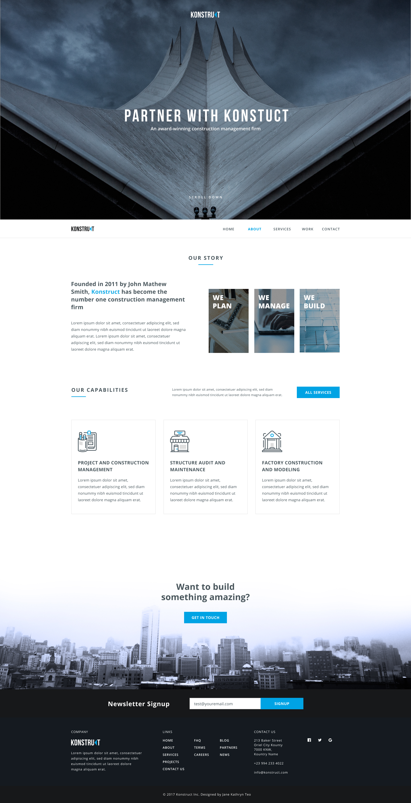

# 🌐 [Building]

<!-- Ссылка на демо-версию -->
[**Посмотреть LIVE-демо**](https://github.com/MrMurlok/Konstruct.git)

---

## 🖼 Скриншот проекта
<p align="center">
  
</p> 
Главный экран сайта с адаптивным меню

---

## 📝 Описание
Персональный сайт-портфолио, созданный для демонстрации проектов. Полностью адаптивная версия.
Имеет адаптивное меню. Выполнена по макету Figma, с точностью pixelperfect.

---

## 🛠 Технологии


---

## 🚀 Инструкция по запуску

Если вы хотите запустить проект локально, выполните следующие шаги:

1. **Клонируйте репозиторий:**
   ```bash
   git clone https://github.com/MrMurlok/Konstruct.git
   
## 🤝 Автор
[]([github.com](https://github.com/MrMurlok))

[](https://t.me/djmurlok)

[](djmurlok.sf@gmail.com)
